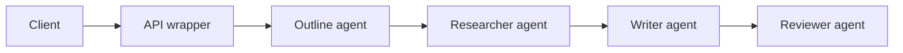
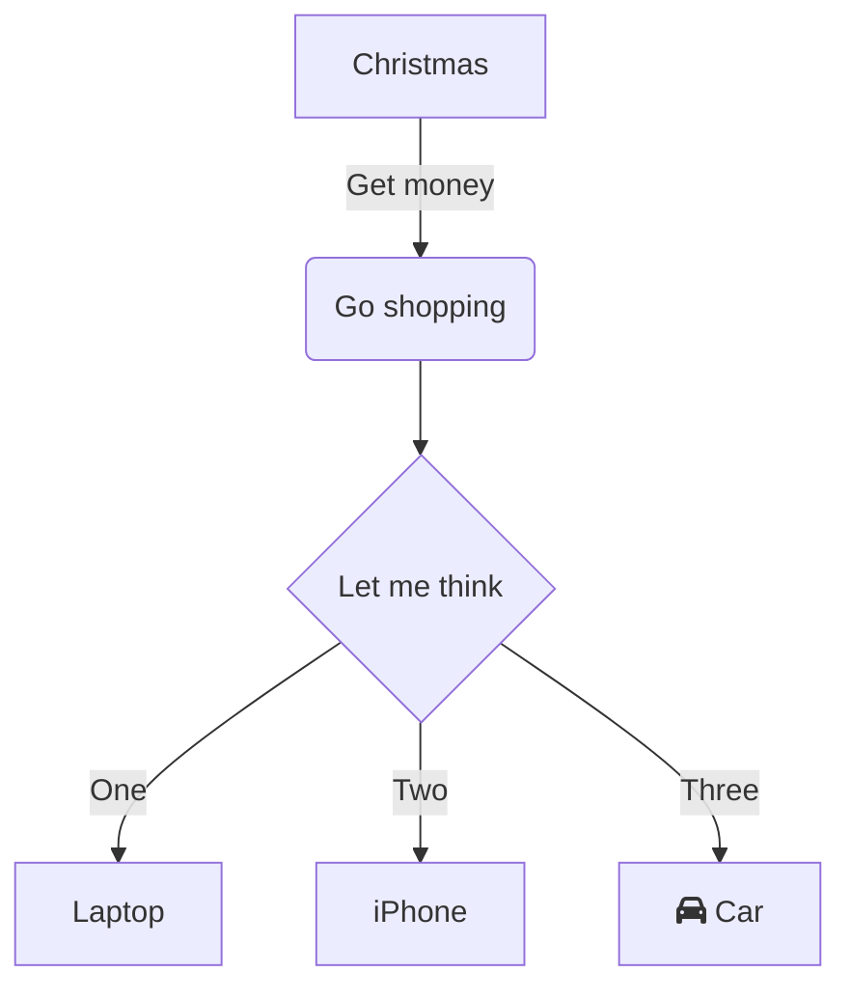

```mermaid
flowchart LR
    A[Client] --> B[API wrapper]
    B --> C[Outline agent]
    C --> D[Researcher agent]
    D --> E[Writer agent]
    E --> F[Reviewer agent]
```

```mermaid
flowchart TD
    A[Christmas] -->|Get money| B(Go shopping)
    B --> C{Let me think}
    C -->|One| D[Laptop]
    C -->|Two| E[iPhone]
    C -->|Three| F[fa:fa-car Car]
```